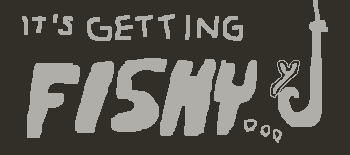

# It's Getting Fishy...
A game about fishing for the [Playdate](https://play.date/) game console, a retro feeling console but with modern programming capabilities and interesting controller inputs.

Made for CodeJam 15 Hackathon 2025

## Playing the game
Even if you don't have a playdate console, you can emulate this game by downloading the SDK right over [here](https://play.date/dev/), which includes a Playdate Simulator.

Once installed, open the simulator and open the `codejamgame.pdx` folder, containing our game

## Inspiration
We wanted to take advantadge of the unique crank mechanism in the Playdate. While thinking of different ideas, we decided to go with a fishing game, as we thought it would be fun with the crank and very intuitive.

## How we made it
This game was made entirely using the **Lua** programming language and the [Playdate SDK](https://sdk.play.date/3.0.1/Inside%20Playdate.html)

We tested and ran this game on real hardware, using a real Playdate console.

### Art
Pixel art was made by us using [Piskel](https://www.piskelapp.com/), a free online pixel art editor.

Maps and tiles were made using [LDtk](https://ldtk.io/).

### Music
Music was made by Santiago, who has musical experience, using Ableton Live

### Sound effects
We used sounds that inspired us on YouTube for the different sound effects of our game

## Challenges we ran into
- None of us had touched Lua before, so it was quite the learning curve!
- At first, we couldn't load the game into the console! We realised the console was running an older software version, so we had to find a way to update the software.
- Our game was having very poor performance when running on actual hardware, we had to go back and refactor some of the code to make it more smooth and performant

## Accomplishments that we're proud of
- We made everything ourselves in a very short amount of time. The code, the music, the art, the sound effects. All from us.

## What we learned
- We learned how to make games, a very different approach to development as what we are all accustomed to. 
- We learned to code with specific hardware in mind, being aware of its limitations, its constraints, etc
- We used our foundations of programming to quickly learn a new language (Lua) and apply it to a challenge.

## What's next for It's Getting Fishy...
We want to see how we can release the game to the public! We will look into releasing the game on [itch.io](https://itch.io/) and seeing if other Playdate owners can play it on their consoles!